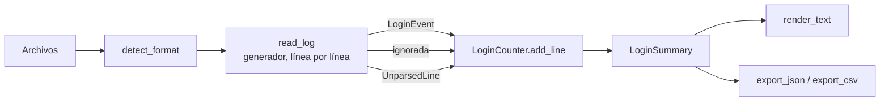

# 09 · Contador de intentos de login

> Herramienta de laboratorio y aprendizaje. Analiza archivos de registro locales; no se conecta a ningún sistema ni modifica nada.

Cuenta los inicios de sesión exitosos y fallidos por usuario y por IP a partir de registros en tres formatos (`lab`, `syslog` de OpenSSH y `csv`), y reporta con número de línea y motivo cada línea que no pudo interpretar.

[← Volver al portafolio de ciberseguridad](../README.md) · Proyecto relacionado: [12 · Detector de múltiples accesos](../12-detector-accesos/README.md)

## Contenido

1. [Qué problema resuelve](#1-qué-problema-resuelve)
2. [Instalación desde cero](#2-instalación-desde-cero)
3. [Comandos](#3-comandos)
4. [Ejemplo de entrada y salida](#4-ejemplo-de-entrada-y-salida)
5. [Archivos y carpetas](#5-archivos-y-carpetas)
6. [Funciones principales y recorrido de los datos](#6-funciones-principales-y-recorrido-de-los-datos)
7. [Dependencias](#7-dependencias)
8. [Limitaciones y errores frecuentes](#8-limitaciones-y-errores-frecuentes)
9. [Pruebas](#9-pruebas)
10. [Ejercicios](#10-ejercicios)
11. [Preguntas de entrevista](#11-preguntas-de-entrevista)
12. [Guion de demostración](#12-guion-de-demostración)
13. [Capturas](#13-capturas)

## 1. Qué problema resuelve

Cuando alguien reporta "no puedo entrar" o un servidor recibe tráfico raro, lo primero es responder preguntas simples sobre el registro de autenticación: ¿cuántos intentos hubo?, ¿cuántos fallaron?, ¿qué cuentas y qué IPs concentran los fallos? Hacerlo a mano con `grep` es lento y fácil de equivocar (líneas repetidas, formatos distintos, fechas sin año).

Útil para:

- Personas que aprenden análisis de logs para soporte técnico, administración de sistemas o un SOC.
- Laboratorios donde se quiere un primer resumen antes de una investigación más profunda.

No sustituye a un SIEM ni a una revisión humana: describe lo que dice el registro, no prueba un ataque.

## 2. Instalación desde cero

Requisitos: Python 3.10 o superior. Comprueba tu versión con `python3 --version` (Linux Mint) o `py --version` (Windows).

**Linux Mint**

```bash
cd Tipos-de-Proyectos/ciberseguridad/09-contador-logins
python3 -m venv .venv
source .venv/bin/activate
python -m pip install -r requirements-dev.txt
```

Si `python3 -m venv` muestra un error sobre `ensurepip`, instala el módulo de entornos virtuales una sola vez: `sudo apt install python3-venv`. Es la única acción con `sudo`; la herramienta en sí nunca lo necesita.

**Windows (PowerShell)**

```powershell
cd Tipos-de-Proyectos\ciberseguridad\09-contador-logins
py -m venv .venv
.\.venv\Scripts\Activate.ps1
python -m pip install -r requirements-dev.txt
```

Si PowerShell bloquea el script de activación, ejecuta una vez `Set-ExecutionPolicy -Scope CurrentUser RemoteSigned` o usa `cmd` con `.venv\Scripts\activate.bat`.

Con el entorno activado, los comandos son idénticos en ambos sistemas. Python acepta `/` en las rutas también en Windows.

## 3. Comandos

Ejecuta todo desde la carpeta `ciberseguridad/09-contador-logins`.

| Objetivo | Comando |
|---|---|
| Analizar el ejemplo en formato lab | `python -m login_counter samples/auth_lab.log` |
| Ver las fechas en hora de Ciudad de México | `python -m login_counter samples/auth_lab.log --tz America/Mexico_City --display-tz America/Mexico_City` |
| Analizar un `auth.log` de OpenSSH | `python -m login_counter samples/auth_syslog.log --year 2026 --tz America/Mexico_City` |
| Analizar un CSV | `python -m login_counter samples/logins.csv` |
| Varios archivos a la vez | `python -m login_counter samples/auth_lab.log samples/auth_syslog.log samples/logins.csv --year 2026` |
| Mostrar todas las filas | `python -m login_counter samples/auth_lab.log --top 0` |
| Exportar a JSON y CSV | `python -m login_counter samples/auth_lab.log --export-json output/resumen.json --export-csv output/conteos.csv` |
| Sobrescribir exportaciones previas | agrega `--force` al comando anterior |
| Forzar un formato | `python -m login_counter mi_archivo.txt --format syslog` |
| Ayuda | `python -m login_counter --help` |
| Pruebas | `python -m pytest` |

Opciones principales:

| Opción | Uso | Valor por defecto |
|---|---|---|
| `--format` | `auto`, `lab`, `syslog` o `csv` | `auto` (detecta cada archivo) |
| `--tz` | zona que se asume si una fecha no la trae | `default_timezone` de la configuración (`UTC`) |
| `--display-tz` | zona en la que se muestran las fechas | `display_timezone` (`UTC`) |
| `--year` | año para syslog tradicional, que no lo registra | año actual |
| `--top` | filas por tabla (0 = todas) | `10` |
| `--config` | otro archivo de configuración | `config/settings.json` |

Los argumentos tienen prioridad sobre `config/settings.json`. Códigos de salida: `0` correcto, `1` error de entrada o configuración, `2` argumentos inválidos.

### Formatos compatibles

**lab**: formato propio del laboratorio, fácil de leer y de generar:

```
2026-09-14T08:10:02-06:00 LOGIN_FAILURE user=admin ip=203.0.113.50 method=password
```

- Fecha ISO 8601 con desplazamiento (`-06:00` o `Z`) u opcionalmente sin él (se asume `--tz`).
- Evento `LOGIN_SUCCESS` o `LOGIN_FAILURE`.
- `user=` e `ip=` obligatorios; otros pares `clave=valor` se ignoran. Los valores no pueden tener espacios.
- Las líneas que empiezan con `#` son comentarios.

**syslog**: `auth.log` de OpenSSH en Linux (Debian, Ubuntu, Linux Mint):

```
Sep 14 08:20:32 lab-server sshd[2301]: Failed password for invalid user oracle from 198.51.100.23 port 40122 ssh2
2026-09-14T08:20:32.000000-06:00 lab-server sshd[2301]: Accepted publickey for ana from 192.0.2.10 port 50122 ssh2
```

- Cabecera tradicional (sin año ni zona: usa `--year` y `--tz`) o ISO 8601 (según la configuración de rsyslog).
- Procesos `sshd` y `sshd-session` (OpenSSH 9.8 y posteriores).
- Cuenta `Accepted <método> for ...` como éxito y `Failed <método> for ...` como fallo, con cualquier método (`password`, `publickey`, `keyboard-interactive/pam`...).
- Expande `message repeated N times: [ ... ]` en N intentos.
- Ignora el resto (`Invalid user`, `Connection closed`, `session opened`, otros procesos).

**csv**: encabezado con `timestamp,user,ip,result` (en cualquier orden, sin importar mayúsculas). `result` debe ser `success` o `failure`. Columnas adicionales se ignoran.

## 4. Ejemplo de entrada y salida

Entrada (`samples/auth_lab.log`, fragmento; todo es sintético):

```
2026-09-14T08:10:02-06:00 LOGIN_FAILURE user=admin ip=203.0.113.50 method=password
2026-09-14T08:15:10-06:00 LOGIN_SUCCESS user=admin ip=203.0.113.51 method=password
2026-09-14T14:11:47Z LOGIN_FAILURE user=admin ip=203.0.113.51 method=password
2026-09-14T10:00:00 LOGIN_SUCCESS user=sofia ip=2001:db8::25 method=publickey
2026-09-14T12:00:00-06:00 LOGIN_FAILURE user=marco
```

Comando:

```bash
python -m login_counter samples/auth_lab.log
```

Salida real (generada al ejecutar el comando en esta versión):

```text
Contador de intentos de login - Cybersecurity Python Lab
========================================================

Archivos analizados
ARCHIVO               FORMATO  LÍNEAS  EVENTOS  IGNORADAS  NO INTERPRETADAS
samples/auth_lab.log  lab          44       29         10                 5

Resumen
  Intentos: 29 | exitosos: 6 | fallidos: 23 (79.3 % de fallos)
  Fallos con usuario inexistente (solo syslog): 0
  Primer evento: 2026-09-14 10:00:00+00:00
  Último evento: 2026-09-14 17:06:40+00:00
  Zona horaria del reporte: UTC

Por usuario (top 10, ordenado por fallos)
USUARIO   EXITOSOS  FALLIDOS  TOTAL
admin            1         7      8
luis             2         6      8
carlos           1         4      5
guest            0         1      1
oracle           0         1      1
postgres         0         1      1
root             0         1      1
test             0         1      1
ubuntu           0         1      1
ana              1         0      1
... 1 más; usa --top 0 para ver todos.

Por IP (todos, ordenado por fallos)
IP             EXITOSOS  FALLIDOS  TOTAL
192.0.2.11            2         6      8
198.51.100.23         0         6      6
192.0.2.30            1         4      5
203.0.113.51          1         4      5
203.0.113.50          0         3      3
192.0.2.10            1         0      1
2001:db8::25          1         0      1

Líneas no interpretadas: 5
  samples/auth_lab.log:40  faltan campos obligatorios: ip=
      2026-09-14T12:00:00-06:00 LOGIN_FAILURE user=marco
  samples/auth_lab.log:41  IP inválida: '999.10.10.10'
      2026-09-14T12:01:00-06:00 LOGIN_SUCCESS user=ana ip=999.10.10.10
  samples/auth_lab.log:42  fecha inexistente: '2026-09-31T12:02:00-06:00'
      2026-09-31T12:02:00-06:00 LOGIN_FAILURE user=ana ip=192.0.2.10
  samples/auth_lab.log:43  evento desconocido 'LOGIN_LOCKED' (se esperaba LOGIN_SUCCESS o LOGIN_FAILURE)
      2026-09-14T12:03:00-06:00 LOGIN_LOCKED user=ana ip=192.0.2.10
  samples/auth_lab.log:44  no sigue el formato lab: '<fecha> LOGIN_SUCCESS|LOGIN_FAILURE user=<u> ip=<ip>'
      esta línea no sigue el formato del laboratorio

Nota: los conteos describen lo que dice el registro; no prueban por sí solos un ataque.
```

Observa dos cosas:

- La línea de `sofia` no trae zona horaria y se asumió UTC, por eso aparece como **primer** evento (10:00 UTC) aunque en la oficina ficticia ocurrió a las 10:00 de Ciudad de México. Con `--tz America/Mexico_City` el primer evento pasa a ser el de `ana` (13:58:12 UTC).
- `marco` no aparece en las tablas: su línea no tiene `ip=` y se reporta como no interpretada en vez de contarse a medias.

Ejemplo con syslog:

```bash
python -m login_counter samples/auth_syslog.log --year 2026 --tz America/Mexico_City --display-tz America/Mexico_City
```

```text
Contador de intentos de login - Cybersecurity Python Lab
========================================================

Archivos analizados
ARCHIVO                  FORMATO  LÍNEAS  EVENTOS  IGNORADAS  NO INTERPRETADAS
samples/auth_syslog.log  syslog       20       13          5                 3

Resumen
  Intentos: 13 | exitosos: 3 | fallidos: 10 (76.9 % de fallos)
  Fallos con usuario inexistente (solo syslog): 3
  Primer evento: 2026-09-14 08:05:12-06:00
  Último evento: 2026-09-14 09:45:20-06:00
  Zona horaria del reporte: America/Mexico_City
  Año asumido para syslog sin año: 2026 (cámbialo con --year)

Por usuario (todos, ordenado por fallos)
USUARIO  EXITOSOS  FALLIDOS  TOTAL
root            0         3      3
admin           0         2      2
luis            1         1      2
sofia           1         1      2
guest           0         1      1
oracle          0         1      1
test            0         1      1
ana             1         0      1

Por IP (todos, ordenado por fallos)
IP             EXITOSOS  FALLIDOS  TOTAL
198.51.100.23         0         6      6
203.0.113.50          0         2      2
192.0.2.11            1         1      2
2001:db8::25          1         1      2
192.0.2.10            1         0      1

Líneas no interpretadas: 3
  samples/auth_syslog.log:18  IP inválida: 'host-sin-ip.example'
      Sep 14 09:50:00 lab-server sshd[2600]: Failed password for root from host-sin-ip.example port 22 ssh2
  samples/auth_syslog.log:19  mensaje de login de sshd incompleto o con un formato inesperado
      Sep 14 09:51:00 lab-server sshd[2601]: Accepted password for
  samples/auth_syslog.log:20  no tiene cabecera syslog (fecha, equipo y mensaje)
      línea dañada sin cabecera syslog

Nota: los conteos describen lo que dice el registro; no prueban por sí solos un ataque.
```

Las 3 cuentas inexistentes (`invalid user`) son `oracle`, `test` y `guest`. `root` suma 3 fallos: una línea normal más `message repeated 2 times`.

## 5. Archivos y carpetas

```
09-contador-logins/
├── README.md               este documento
├── requirements.txt        dependencias de ejecución (solo tzdata en Windows)
├── requirements-dev.txt    + pytest para las pruebas
├── pytest.ini              configura pytest (carpeta tests/, importar sin instalar)
├── config/settings.json    configuración editable
├── login_counter/
│   ├── __init__.py         versión del paquete
│   ├── __main__.py         permite ejecutar "python -m login_counter"
│   ├── cli.py              argumentos, mensajes de error y códigos de salida
│   ├── config.py           lee y valida config/settings.json
│   ├── models.py           LoginEvent, UnparsedLine, Outcome         (copia compartida con el 12)
│   ├── timeutils.py        zonas horarias, fechas ISO, conversión a UTC (copia compartida con el 12)
│   ├── parsers.py          lectores lab, syslog y csv; detección de formato (copia compartida con el 12)
│   ├── counter.py          lógica de conteo: Tally, LoginCounter, analyze_files, ranked
│   └── report.py           texto para terminal, exportación JSON/CSV, limpieza de texto no confiable
├── samples/
│   ├── README.md           descripción de los datos sintéticos
│   ├── auth_lab.log        formato lab, con desorden, zonas mixtas y 5 errores intencionales
│   ├── auth_syslog.log     formato auth.log de OpenSSH, con repeticiones y 3 errores
│   └── logins.csv          formato CSV, con un usuario malicioso y 2 errores
├── tests/                  pruebas automáticas (pytest)
└── docs/screenshots/       aquí van tus capturas reales
```

Los tres módulos marcados como copia son idénticos en los proyectos 09 y 12; `tools/check_shared_copies.py` (en la carpeta `ciberseguridad/`) verifica que sigan iguales. Motivo en [docs/ARQUITECTURA.md](../docs/ARQUITECTURA.md).

## 6. Funciones principales y recorrido de los datos



1. **`cli.main`** lee argumentos, combina con `config/settings.json`, valida zonas horarias, que los archivos existan y que las exportaciones no sobrescriban nada sin `--force`.
2. **`parsers.detect_format`** decide el formato por la extensión `.csv` o por las primeras líneas con contenido.
3. **`parsers.read_log`** es un generador: abre el archivo con `encoding="utf-8-sig"` y `errors="replace"`, y produce un `LineResult` por línea con eventos, nada (ignorada) o un `UnparsedLine` con el motivo.
4. **`parse_lab_line` / `parse_syslog_line` / `_iter_csv`** validan cada campo: fecha con `timeutils.parse_iso_timestamp` (convertida a UTC), IP con `normalize_ip` (módulo `ipaddress`).
5. **`counter.LoginCounter`** acumula en contadores (`Tally`) el total, por usuario y por IP. No guarda los eventos, así que la memoria depende del número de usuarios e IPs distintos, no del tamaño del archivo.
6. **`counter.ranked`** ordena por fallos, luego por total y luego alfabéticamente, para que el resultado sea estable.
7. **`report.render_text`** arma las tablas; **`export_json`** y **`export_csv`** guardan el resultado en UTC. `clean_text` escapa caracteres de control en la terminal y `safe_csv_cell` neutraliza fórmulas en CSV.

## 7. Dependencias

| Paquete | Para qué | Cuándo |
|---|---|---|
| Biblioteca estándar (`re`, `csv`, `ipaddress`, `zoneinfo`, `argparse`, `pathlib`, `json`) | todo el análisis | siempre |
| `tzdata` | base de datos de zonas horarias IANA para `zoneinfo` | solo Windows (Linux Mint la trae en el sistema). Sin ella fallan nombres como `America/Mexico_City` |
| `pytest` | pruebas automáticas | solo desarrollo |

## 8. Limitaciones y errores frecuentes

**Limitaciones**

- Solo entiende los tres formatos documentados. Los registros de Windows (Visor de eventos, IDs 4624/4625) son binarios `.evtx` y no se leen.
- Syslog tradicional no guarda el año: un archivo que cruza de diciembre a enero quedará con fechas en el año equivocado. Usa `--year` o la cabecera ISO de rsyslog.
- Si `sshd` está configurado con `UseDNS yes`, puede registrar nombres de host en lugar de IPs; esas líneas se reportan como no interpretadas.
- Distingue mayúsculas en usuarios (`Admin` y `admin` son cuentas distintas, como en Linux).
- Las horas repetidas en un cambio de horario se interpretan como la primera aparición.
- Los nombres de usuario o valores con espacios no se admiten en el formato lab.

**Errores frecuentes**

| Mensaje | Causa | Solución |
|---|---|---|
| `No se reconoce el formato de ...` | las primeras líneas no coinciden con ningún formato | revisa el archivo o usa `--format` |
| `Zona horaria desconocida` | nombre mal escrito o falta `tzdata` en Windows | escribe el nombre exacto (`America/Mexico_City`) o reinstala `requirements.txt` |
| `... ya existe. Usa --force` | protección contra sobrescritura | cambia el nombre o agrega `--force` |
| `sin permiso para acceder a ...` | intentas leer `/var/log/auth.log` sin permisos | trabaja con los ejemplos o con una copia; no uses `sudo` con la herramienta |
| `ModuleNotFoundError: login_counter` | ejecutas desde otra carpeta | entra a `ciberseguridad/09-contador-logins` antes de ejecutar |

Si analizas un registro real de tu equipo, no lo guardes dentro del repositorio: contiene IPs y usuarios reales. El `.gitignore` ignora `*.log` fuera de `samples/` como protección adicional.

## 9. Pruebas

```bash
python -m pytest            # todas
python -m pytest -v         # con el nombre de cada prueba
python -m pytest tests/test_parsers.py -k syslog   # solo un grupo
```

| Archivo | Qué comprueba |
|---|---|
| `test_timeutils.py` | zonas IANA y desplazamientos, conversión a UTC, fechas inválidas, formato de duraciones |
| `test_parsers.py` | cada formato, `invalid user`, `message repeated`, límite de repeticiones, IPv6 e IPv4 mapeada, BOM y CRLF de Windows, bytes inválidos, CSV sin columnas |
| `test_counter.py` | totales de los tres ejemplos, conteos por usuario e IP, efecto de la zona horaria, varios archivos, límite de líneas guardadas |
| `test_cli.py` | salida, `--top`, exportaciones, protección contra sobrescritura, errores de entrada, neutralización de texto malicioso, ejecución con `python -m` |

**Pruebas ejecutadas** al preparar esta entrega (Linux x86_64 en la nube, 5 de octubre de 2026): `python -m pytest` → **70 passed** con Python 3.10.20, 3.11.17, 3.12.3 y 3.13.16 (pytest 9.1.1), cada versión en un entorno virtual nuevo instalado con `requirements-dev.txt`. También `python tools/check_shared_copies.py` → 3 módulos OK y `python menu.py --test-all` → `Proyectos probados: 2 | con fallos: 0`.

**Pruebas pendientes de ejecutar por ti**: Linux Mint y Windows en tus equipos. Para que GitHub las ejecute también en Ubuntu y Windows en cada cambio, activa la integración continua opcional (ver [docs/GITHUB.md](../docs/GITHUB.md#5-integración-continua-opcional)).

## 10. Ejercicios

1. **Nuevo formato JSON Lines.** Agrega `parse_jsonl_line` en `parsers.py` para líneas como `{"ts": "...", "user": "...", "ip": "...", "ok": true}` usando `json.loads`. Regístralo en `_LINE_PARSERS` y `SUPPORTED_FORMATS`, y escribe pruebas para una línea válida, JSON inválido y campos faltantes. Recuerda copiar el cambio al proyecto 12 y ejecutar `python tools/check_shared_copies.py`.
2. **Columna de porcentaje y orden configurable.** Agrega a las tablas la columna `% FALLOS` y una opción `--sort {failures,total,name}`. Pista: `ranked` recibe hoy un orden fijo; conviértelo en un parámetro y prueba los tres órdenes.
3. **Actividad por hora.** Agrega una sección "Fallos por hora" que cuente fallos por hora del día en `--display-tz` (0-23) y los muestre como una barra de texto con `#`. Piensa por qué la hora debe calcularse después de convertir de UTC a la zona elegida.

## 11. Preguntas de entrevista

**1. ¿Por qué procesas el archivo línea por línea en vez de leerlo completo?**
Porque los registros de autenticación pueden pesar varios GB. `read_log` es un generador y `LoginCounter` solo guarda contadores, así que la memoria crece con la cantidad de usuarios e IPs distintos, no con el tamaño del archivo. Leerlo completo con `read()` podría agotar la memoria del equipo.

**2. En `auth.log` aparece "Invalid user oracle" y después "Failed password for invalid user oracle". ¿Cuántos intentos son?**
Uno. La primera línea es un aviso de que la cuenta no existe; la segunda es el resultado del intento. Por eso solo cuento las frases `Accepted ... for` y `Failed ... for`. A la inversa, `message repeated 2 times: [Failed password ...]` sí representa dos intentos adicionales que rsyslog resumió, y los expando (con un tope de 10 000 para que un registro manipulado no agote la memoria).

**3. ¿Por qué validas las IPs con `ipaddress` y no solo con una expresión regular?**
Una regex como `\d+\.\d+\.\d+\.\d+` acepta `999.10.10.10`. `ipaddress` valida rangos, entiende IPv6 y normaliza: `2001:0db8::0025` y `2001:db8::25` son la misma dirección, y `::ffff:192.0.2.1` es la IPv4 `192.0.2.1`. Sin normalizar, una misma máquina aparecería como varias IPs y los conteos serían engañosos.

**4. ¿Qué haces con las líneas que no entiendes?**
No las descarto en silencio. Distingo entre líneas ignoradas (válidas pero sin relación con un login) y no interpretadas (parecen relevantes pero están dañadas), y para estas guardo archivo, número de línea y motivo. Ocultarlas daría una falsa sensación de exactitud; un atacante también podría generar líneas malformadas a propósito.

**5. ¿Qué riesgos de seguridad tiene una herramienta que solo lee logs?**
Los logs son entrada no confiable: un atacante elige el nombre de usuario que intenta. Si ese nombre contiene secuencias ANSI, podría alterar la terminal, por eso `clean_text` escapa caracteres de control. Si empieza con `=`, Excel podría ejecutarlo como fórmula al abrir el CSV (inyección CSV), por eso `safe_csv_cell` le antepone `'`. Además, la herramienta no necesita permisos de administrador y no sobrescribe archivos sin `--force`.

## 12. Guion de demostración

Duración aproximada: 2 minutos.

1. (10 s) "Este es el contador de intentos de login de mi laboratorio de ciberseguridad en Python. Todo lo que verán usa datos sintéticos."
2. (20 s) Abre `samples/auth_lab.log` y señala el encabezado de datos sintéticos, una línea `LOGIN_FAILURE`, una línea en `Z` y las líneas con errores al final.
3. (30 s) Ejecuta `python -m login_counter samples/auth_lab.log`. Explica la tabla de archivos (líneas, eventos, ignoradas, no interpretadas) y el resumen.
4. (20 s) Señala `admin` con 7 fallos y la IP `198.51.100.23` con 6 fallos en 6 cuentas distintas: "esto merece revisarse con el detector del proyecto 12".
5. (20 s) Muestra las líneas no interpretadas: "no se ocultan; cada una dice su número de línea y por qué se rechazó".
6. (15 s) Ejecuta con `--tz America/Mexico_City` y muestra cómo cambia el primer evento: "por eso normalizo todo a UTC".
7. (15 s) Exporta a CSV y ábrelo en una hoja de cálculo con `logins.csv` para mostrar el usuario `'=HYPERLINK(1)` neutralizado. Cierra con: "es una herramienta de laboratorio; describe el registro, no prueba un ataque".

## 13. Capturas

Pendiente: agrega capturas reales después de ejecutar la herramienta en tu equipo y guárdalas en [`docs/screenshots/`](docs/screenshots/README.md). No uses capturas generadas por otra persona o herramienta.

<!-- Ejemplo, cuando exista el archivo:

-->
