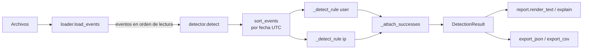

# 12 · Detector de múltiples accesos

> Herramienta de laboratorio y aprendizaje. Genera alertas explicables; **no bloquea cuentas ni direcciones IP** y no modifica ningún sistema.

Detecta cuándo una misma cuenta o una misma IP acumula demasiados intentos de login fallidos dentro de una ventana de tiempo configurable. Ordena registros desordenados, compara fechas de distintas zonas horarias en UTC y explica cada alerta con datos verificables: intervalo, IPs o cuentas involucradas, acceso exitoso posterior y líneas de evidencia.

[← Volver al portafolio de ciberseguridad](../README.md) · Proyecto relacionado: [09 · Contador de intentos de login](../09-contador-logins/README.md)

## Contenido

1. [Qué problema resuelve](#1-qué-problema-resuelve)
2. [Instalación desde cero](#2-instalación-desde-cero)
3. [Comandos](#3-comandos)
4. [Ejemplo de entrada y salida](#4-ejemplo-de-entrada-y-salida)
5. [Archivos y carpetas](#5-archivos-y-carpetas)
6. [Funciones principales y recorrido de los datos](#6-funciones-principales-y-recorrido-de-los-datos)
7. [Dependencias](#7-dependencias)
8. [Limitaciones y errores frecuentes](#8-limitaciones-y-errores-frecuentes)
9. [Pruebas](#9-pruebas)
10. [Ejercicios](#10-ejercicios)
11. [Preguntas de entrevista](#11-preguntas-de-entrevista)
12. [Guion de demostración](#12-guion-de-demostración)
13. [Capturas](#13-capturas)

## 1. Qué problema resuelve

Un conteo total de fallos no distingue entre "una persona olvidó su contraseña tres veces en la semana" y "alguien probó 50 contraseñas en dos minutos". Lo que importa es la **concentración en el tiempo**. Este detector aplica dos reglas clásicas:

- **Por cuenta**: muchos fallos contra la misma cuenta (fuerza bruta), aunque vengan de IPs distintas.
- **Por IP**: muchos fallos desde la misma IP (incluye *password spraying*: una contraseña común probada en muchas cuentas).

Útil para practicar la lógica de detección que usan herramientas como fail2ban o las reglas de un SIEM, y para aprender a justificar una alerta ante otra persona.

## 2. Instalación desde cero

Requisitos: Python 3.10 o superior.

**Linux Mint**

```bash
cd Tipos-de-Proyectos/ciberseguridad/12-detector-accesos
python3 -m venv .venv
source .venv/bin/activate
python -m pip install -r requirements-dev.txt
```

Si aparece un error sobre `ensurepip`: `sudo apt install python3-venv` (una sola vez; la herramienta no necesita `sudo`).

**Windows (PowerShell)**

```powershell
cd Tipos-de-Proyectos\ciberseguridad\12-detector-accesos
py -m venv .venv
.\.venv\Scripts\Activate.ps1
python -m pip install -r requirements-dev.txt
```

Si PowerShell bloquea la activación: `Set-ExecutionPolicy -Scope CurrentUser RemoteSigned`, o usa `cmd` con `.venv\Scripts\activate.bat`.

## 3. Comandos

Desde la carpeta `ciberseguridad/12-detector-accesos`:

| Objetivo | Comando |
|---|---|
| Analizar el ejemplo | `python -m failed_login_detector samples/auth_lab.log` |
| Ver fechas en hora de Ciudad de México | `python -m failed_login_detector samples/auth_lab.log --display-tz America/Mexico_City` |
| Ventana más amplia | `python -m failed_login_detector samples/auth_lab.log --window 10` |
| Umbral más estricto | `python -m failed_login_detector samples/auth_lab.log --threshold 8` |
| Solo regla por IP | `python -m failed_login_detector samples/auth_lab.log --by ip` |
| Actividad normal (sin alertas) | `python -m failed_login_detector samples/normal_activity.log` |
| Correlacionar dos fuentes con zonas distintas | `python -m failed_login_detector samples/multi_fuente/servidor_web.log samples/multi_fuente/vpn.csv --display-tz America/Mexico_City` |
| `auth.log` de OpenSSH | `python -m failed_login_detector samples/auth_syslog.log --year 2026 --tz America/Mexico_City` |
| Exportar | `python -m failed_login_detector samples/auth_lab.log --export-json output/alertas.json --export-csv output/alertas.csv` |
| Ayuda | `python -m failed_login_detector --help` |
| Pruebas | `python -m pytest` |

| Opción | Uso | Por defecto (`config/settings.json`) |
|---|---|---|
| `--threshold N` | fallos necesarios para alertar (mínimo 2) | `5` |
| `--window MIN` | separación máxima entre el primer y el último fallo contado | `5` |
| `--success-after MIN` | margen tras la ráfaga para buscar un acceso exitoso | `15` |
| `--by` | `user`, `ip` o `both` | `both` |
| `--tz` / `--display-tz` | zona para fechas sin desplazamiento / zona del reporte | `UTC` / `UTC` |
| `--year` | año para syslog tradicional | año actual |
| `--format` | `auto`, `lab`, `syslog`, `csv` | `auto` |
| `--force` | permite sobrescribir exportaciones | desactivado |

Formatos de entrada: los mismos del proyecto 09 (`lab`, `syslog` de OpenSSH y `csv`), documentados en su [README](../09-contador-logins/README.md#formatos-compatibles).

### Regla exacta

Hay alerta para una clave (cuenta o IP) cuando existen **al menos `threshold` fallos cuyo primero y último están separados por como máximo `window` minutos** (límite inclusivo). Si los fallos siguen llegando sin interrumpir la ráfaga, se amplía la misma alerta en lugar de crear una nueva por cada fallo. La severidad es **media** por defecto y **alta** si hubo un acceso exitoso de la misma clave durante la ráfaga o hasta `success-after` minutos después.

## 4. Ejemplo de entrada y salida

Entrada: `samples/auth_lab.log` (sintético). Contiene, entre otras cosas:

- 7 fallos contra `admin` en 3.5 minutos desde **dos** IPs, algunas líneas en UTC (`Z`) y fuera de orden, seguidos de un acceso exitoso.
- 6 fallos desde `198.51.100.23` contra 6 cuentas distintas (*password spraying*).
- 4 fallos de `carlos` repartidos en dos horas (no debe alertar).
- 5 fallos de `luis` en 6 minutos (no alerta con ventana de 5; sí con 10).

Comando:

```bash
python -m failed_login_detector samples/auth_lab.log --display-tz America/Mexico_City
```

Salida real:

```text
Detector de múltiples intentos fallidos - Cybersecurity Python Lab
==================================================================

Archivos analizados
ARCHIVO               FORMATO  LÍNEAS  EVENTOS  IGNORADAS  NO INTERPRETADAS
samples/auth_lab.log  lab          44       29         10                 5

Resumen
  Eventos: 29 (fallidos: 23, exitosos: 6)
  Eventos fuera de orden en los archivos: 6 (se ordenan antes de analizar)
  Configuración: umbral 5 fallos | ventana 5 min | éxito posterior: 15 min | reglas: Cuenta, IP
  Zona horaria del reporte: America/Mexico_City

Alertas: 2

[1] Severidad ALTA - Cuenta 'admin'
    7 intentos fallidos entre 2026-09-14 08:10:02-06:00 y 2026-09-14 08:13:30-06:00 (3 min 28 s).
    Regla: 5 o más fallos en una ventana de 5 min.
    IPs de origen (2): 203.0.113.50, 203.0.113.51
    Acceso EXITOSO 1 min 40 s después del último fallo: 2026-09-14 08:15:10-06:00 desde 203.0.113.51 (samples/auth_lab.log:16). Verifica si fue legítimo.
    Evidencia: samples/auth_lab.log líneas 13, 14, 15, 17, 18, 19, 20

[2] Severidad MEDIA - IP '198.51.100.23'
    6 intentos fallidos entre 2026-09-14 09:15:00-06:00 y 2026-09-14 09:17:30-06:00 (2 min 30 s).
    Regla: 5 o más fallos en una ventana de 5 min.
    Cuentas intentadas (6): guest, oracle, postgres, root, test, ubuntu
    Sin acceso exitoso de la misma IP hasta 15 min después de la ráfaga.
    Evidencia: samples/auth_lab.log líneas 22, 23, 24, 25, 26, 27

Líneas no interpretadas: 5 (no participan en la detección)
  samples/auth_lab.log:40  faltan campos obligatorios: ip=
  samples/auth_lab.log:41  IP inválida: '999.10.10.10'
  samples/auth_lab.log:42  fecha inexistente: '2026-09-31T12:02:00-06:00'
  samples/auth_lab.log:43  evento desconocido 'LOGIN_LOCKED' (se esperaba LOGIN_SUCCESS o LOGIN_FAILURE)
  samples/auth_lab.log:44  no sigue el formato lab: '<fecha> LOGIN_SUCCESS|LOGIN_FAILURE user=<u> ip=<ip>'

Nota: Esta herramienta no bloquea cuentas ni direcciones. Las alertas son indicios para revisión humana: puede haber falsos positivos (usuarios que olvidaron su contraseña) y falsos negativos (ataques lentos o distribuidos por debajo del umbral).
```

Fíjate en que la regla por IP **no** detectó el ataque a `admin` (cada IP tuvo 3 y 4 fallos), pero la regla por cuenta sí. Y la regla por cuenta no detectó el *spraying* (1 fallo por cuenta), pero la regla por IP sí. Por eso se usan ambas.

Con `--window 10` aparecen también las ráfagas lentas de `luis` y de su IP:

```bash
python -m failed_login_detector samples/auth_lab.log --window 10 --display-tz America/Mexico_City
```

Fragmento de la salida real (solo la sección de alertas):

```text
Alertas: 4

[1] Severidad ALTA - Cuenta 'admin'
    7 intentos fallidos entre 2026-09-14 08:10:02-06:00 y 2026-09-14 08:13:30-06:00 (3 min 28 s).
    Regla: 5 o más fallos en una ventana de 10 min.
    IPs de origen (2): 203.0.113.50, 203.0.113.51
    Acceso EXITOSO 1 min 40 s después del último fallo: 2026-09-14 08:15:10-06:00 desde 203.0.113.51 (samples/auth_lab.log:16). Verifica si fue legítimo.
    Evidencia: samples/auth_lab.log líneas 13, 14, 15, 17, 18, 19, 20

[2] Severidad MEDIA - IP '198.51.100.23'
    6 intentos fallidos entre 2026-09-14 09:15:00-06:00 y 2026-09-14 09:17:30-06:00 (2 min 30 s).
    Regla: 5 o más fallos en una ventana de 10 min.
    Cuentas intentadas (6): guest, oracle, postgres, root, test, ubuntu
    Sin acceso exitoso de la misma IP hasta 15 min después de la ráfaga.
    Evidencia: samples/auth_lab.log líneas 22, 23, 24, 25, 26, 27

[3] Severidad ALTA - IP '192.0.2.11'
    5 intentos fallidos entre 2026-09-14 11:00:00-06:00 y 2026-09-14 11:06:00-06:00 (6 min 0 s).
    Regla: 5 o más fallos en una ventana de 10 min.
    Cuentas intentadas (1): luis
    Acceso EXITOSO 40 s después del último fallo: 2026-09-14 11:06:40-06:00 con la cuenta luis (samples/auth_lab.log:38). Verifica si fue legítimo.
    Evidencia: samples/auth_lab.log líneas 33, 34, 35, 36, 37

[4] Severidad ALTA - Cuenta 'luis'
    5 intentos fallidos entre 2026-09-14 11:00:00-06:00 y 2026-09-14 11:06:00-06:00 (6 min 0 s).
    Regla: 5 o más fallos en una ventana de 10 min.
    IPs de origen (1): 192.0.2.11
    Acceso EXITOSO 40 s después del último fallo: 2026-09-14 11:06:40-06:00 desde 192.0.2.11 (samples/auth_lab.log:38). Verifica si fue legítimo.
    Evidencia: samples/auth_lab.log líneas 33, 34, 35, 36, 37
```

Más ventana detecta más, pero también genera más falsos positivos: ese es el compromiso que se ajusta con datos reales del entorno.

### Correlación entre fuentes y zonas horarias

`samples/multi_fuente/` simula dos sistemas del mismo laboratorio: un servidor web que registra en hora de Ciudad de México (`-06:00`) y una VPN que registra en UTC. La cuenta `elena` tiene 3 fallos en el servidor web y 2 en la VPN. Analizados por separado, ninguno llega al umbral de 5. Juntos, y ya convertidos a UTC, son 5 fallos en menos de 3 minutos seguidos de un acceso exitoso por la VPN. Observa también que la VPN ya registra el día **16** mientras el servidor web sigue en el **15**: comparar fechas como texto daría un resultado incorrecto.

```bash
python -m failed_login_detector samples/multi_fuente/servidor_web.log samples/multi_fuente/vpn.csv --display-tz America/Mexico_City
```

```text
Detector de múltiples intentos fallidos - Cybersecurity Python Lab
==================================================================

Archivos analizados
ARCHIVO                                FORMATO  LÍNEAS  EVENTOS  IGNORADAS  NO INTERPRETADAS
samples/multi_fuente/servidor_web.log  lab           8        6          2                 0
samples/multi_fuente/vpn.csv           csv           5        4          0                 0

Resumen
  Eventos: 10 (fallidos: 6, exitosos: 4)
  Eventos fuera de orden en los archivos: 4 (se ordenan antes de analizar)
  Configuración: umbral 5 fallos | ventana 5 min | éxito posterior: 15 min | reglas: Cuenta, IP
  Zona horaria del reporte: America/Mexico_City

Alertas: 1

[1] Severidad ALTA - Cuenta 'elena'
    5 intentos fallidos entre 2026-09-15 22:01:10-06:00 y 2026-09-15 22:04:05-06:00 (2 min 55 s).
    Regla: 5 o más fallos en una ventana de 5 min.
    IPs de origen (2): 198.51.100.90, 203.0.113.80
    Acceso EXITOSO 1 min 25 s después del último fallo: 2026-09-15 22:05:30-06:00 desde 198.51.100.90 (samples/multi_fuente/vpn.csv:4). Verifica si fue legítimo.
    Evidencia: samples/multi_fuente/servidor_web.log líneas 4, 5, 6; samples/multi_fuente/vpn.csv líneas 2, 3

Nota: Esta herramienta no bloquea cuentas ni direcciones. Las alertas son indicios para revisión humana: puede haber falsos positivos (usuarios que olvidaron su contraseña) y falsos negativos (ataques lentos o distribuidos por debajo del umbral).
```

## 5. Archivos y carpetas

```
12-detector-accesos/
├── README.md                 este documento
├── requirements.txt          dependencias de ejecución (solo tzdata en Windows)
├── requirements-dev.txt      + pytest
├── pytest.ini                configuración de pruebas
├── config/settings.json      umbral, ventana, reglas, zonas horarias (editable)
├── failed_login_detector/
│   ├── __init__.py           versión
│   ├── __main__.py           permite "python -m failed_login_detector"
│   ├── cli.py                argumentos, combinación con la configuración, errores
│   ├── config.py             lectura y validación de settings.json
│   ├── loader.py             lee los archivos y junta eventos y estadísticas
│   ├── detector.py           ventana deslizante, alertas, acceso exitoso posterior
│   ├── report.py             explicación de alertas, texto, JSON y CSV
│   ├── models.py             LoginEvent, UnparsedLine, Outcome          (copia compartida con el 09)
│   ├── timeutils.py          zonas horarias y conversión a UTC            (copia compartida con el 09)
│   └── parsers.py            lectores lab, syslog y csv                   (copia compartida con el 09)
├── samples/
│   ├── README.md             descripción de los datos sintéticos
│   ├── auth_lab.log          ataques simulados, desorden y zonas mixtas
│   ├── auth_syslog.log       auth.log de OpenSSH con spraying
│   ├── logins.csv            CSV pequeño
│   ├── normal_activity.log   día normal: no debe generar alertas
│   └── multi_fuente/         servidor web (-06:00) + VPN (UTC): ataque visible solo al combinarlos
├── tests/                    pruebas automáticas
└── docs/screenshots/         tus capturas reales
```

## 6. Funciones principales y recorrido de los datos



1. **`loader.load_events`** usa los lectores compartidos (`parsers.read_log`) y guarda todos los eventos, porque hay que ordenarlos antes de analizarlos.
2. **`detector.sort_events`** ordena por fecha UTC con un orden estable (a igual fecha conserva el orden de lectura). `count_out_of_order` informa cuántos eventos venían desordenados.
3. **`detector._detect_rule`** recorre los fallos una vez. Para cada clave mantiene un `deque` con los fallos dentro de la ventana: agrega a la derecha, saca por la izquierda los que quedaron fuera (`timestamp < actual - ventana`). Si el `deque` alcanza el umbral, abre una alerta o amplía la activa si la ráfaga sigue. La posición de cada evento evita contarlo dos veces.
4. **`detector._attach_successes`** busca con búsqueda binaria (`bisect`) el primer éxito de la misma clave desde el inicio de la ráfaga hasta `success_after` minutos después del último fallo. Va en una segunda pasada porque el éxito puede ocurrir antes de que la alerta exista.
5. **`report.explain`** convierte cada alerta en frases verificables; **`render_text`**, **`export_json`** y **`export_csv`** las presentan. El texto no confiable se limpia igual que en el proyecto 09.

Complejidad: ordenar es O(n log n); la ventana es O(n) porque cada evento entra y sale del `deque` una sola vez.

## 7. Dependencias

| Paquete | Para qué | Cuándo |
|---|---|---|
| Biblioteca estándar (`collections.deque`, `bisect`, `datetime`, `zoneinfo`, `re`, `csv`, `ipaddress`, `argparse`, `json`, `pathlib`) | lectura, detección y reportes | siempre |
| `tzdata` | zonas horarias IANA para `zoneinfo` en Windows | solo Windows |
| `pytest` | pruebas | solo desarrollo |

## 8. Limitaciones y errores frecuentes

**Limitaciones**

- Carga todos los eventos en memoria para ordenarlos. Con registros de decenas de millones de líneas conviene un modo de flujo que asuma orden (ver ejercicio 2).
- Una misma ráfaga puede generar dos alertas, una por cuenta y otra por IP. Es intencional: responden preguntas distintas.
- No detecta ataques lentos (por debajo del umbral en cualquier ventana) ni distribuidos entre muchas IPs y cuentas a la vez.
- Un "acceso exitoso posterior" no prueba un compromiso: puede ser el usuario legítimo que por fin recordó su contraseña. Por eso la alerta pide verificarlo.
- Depende de que los relojes de los servidores estén sincronizados (NTP). Un reloj desfasado mueve los eventos fuera de la ventana real.
- Hereda las limitaciones de formato del proyecto 09 (syslog sin año, nombres de host en lugar de IPs, registros de Windows no compatibles).

**Por qué no bloquea**

Bloquear automáticamente convierte un falso positivo en una interrupción del servicio, y un atacante podría provocar bloqueos a propósito contra cuentas legítimas (denegación de servicio). Detectar y responder son decisiones separadas; la respuesta (bloqueo temporal, MFA, aviso al usuario) la decide una persona o una herramienta dedicada.

**Errores frecuentes**

| Mensaje | Causa | Solución |
|---|---|---|
| `Error: el umbral debe ser al menos 2 fallos` | `--threshold 1` | un solo fallo no es "múltiples accesos" |
| `Error: --window debe ser mayor que 0 minutos` | `--window 0` | usa minutos positivos, se aceptan decimales (`--window 0.5`) |
| `Zona horaria desconocida` | nombre mal escrito o falta `tzdata` en Windows | nombre exacto o reinstala `requirements.txt` |
| `... ya existe. Usa --force` | protección contra sobrescritura | otro nombre o `--force` |
| Alertas en horarios extraños | fechas sin zona interpretadas como UTC | usa `--tz` con la zona del servidor que generó el registro |

## 9. Pruebas

```bash
python -m pytest
python -m pytest -v tests/test_detector.py
```

| Archivo | Qué comprueba |
|---|---|
| `test_detector.py` | umbral exacto, límite inclusivo de la ventana, una alerta por ráfaga continua, ráfagas separadas, entrada desordenada (mismo resultado), zonas horarias mezcladas, rotación de IPs, *password spraying*, reglas activas, éxito durante y después de la ráfaga, límite de evidencia, parámetros inválidos |
| `test_cli.py` | resultados de los ejemplos con distintas opciones, correlación de dos fuentes con zonas distintas, exportaciones, protección contra sobrescritura, errores, texto malicioso, ejecución con `python -m` |
| `test_parsers.py`, `test_timeutils.py` | los mismos casos del proyecto 09 para las copias compartidas |

**Pruebas ejecutadas** al preparar esta entrega (Linux x86_64 en la nube, 5 de octubre de 2026): `python -m pytest` → **88 passed** con Python 3.10.20, 3.11.17, 3.12.3 y 3.13.16 (pytest 9.1.1), cada versión en un entorno virtual nuevo instalado con `requirements-dev.txt`. También `python tools/check_shared_copies.py` → 3 módulos OK y `python menu.py --test-all` → `Proyectos probados: 2 | con fallos: 0`.

**Pruebas pendientes de ejecutar por ti**: Linux Mint y Windows en tus equipos. La integración continua (Ubuntu y Windows en GitHub) está preparada pero desactivada: ver [docs/GITHUB.md](../docs/GITHUB.md#5-integración-continua-opcional).

## 10. Ejercicios

1. **Regla de cuentas distintas.** Agrega una regla `distinct_users`: alerta si una IP intenta al menos N cuentas **diferentes** en la ventana (más específica para *password spraying* que contar fallos). Pista: además del `deque`, lleva un `Counter` de usuarios dentro de la ventana y actualízalo al sacar eventos.
2. **Modo de flujo.** Agrega `--assume-sorted` para procesar eventos sin cargarlos todos en memoria. Detecta y reporta cuando aparezca un evento con fecha anterior al último procesado. Mide con un archivo grande generado por un script cuánto cambia el uso de memoria.
3. **Lista de excepciones.** Agrega a `settings.json` una lista `allowlist_ips` (por ejemplo, el escáner interno de vulnerabilidades) cuyas alertas se marquen como "excluida" en vez de desaparecer. Discute por qué es más seguro marcarlas que ocultarlas.

## 11. Preguntas de entrevista

**1. ¿Cómo funciona tu ventana deslizante y cuál es su complejidad?**
Ordeno los eventos por fecha y, para cada cuenta o IP, mantengo un `deque` con sus fallos recientes. Cada fallo nuevo entra por la derecha; por la izquierda salen los que tienen más de `window` minutos de antigüedad respecto al actual. Si quedan al menos `threshold`, hay alerta. Cada evento entra y sale una vez, así que la ventana es O(n) y el costo dominante es ordenar, O(n log n).

**2. ¿Por qué conviertes todas las fechas a UTC?**
Porque los registros pueden mezclar desplazamientos (`-06:00` y `Z`) y en Python dos `datetime` con el mismo objeto de zona IANA se comparan por hora local, lo que da resultados incorrectos en cambios de horario. Normalizando a UTC al leer, ordenar y restar fechas es siempre correcto, y solo convierto a la zona del usuario al mostrar. En las pruebas, `08:00-06:00` y `14:03Z` caen en la misma ventana.

**3. ¿Por qué dos reglas, por cuenta y por IP?**
Porque cubren ataques distintos. Un atacante que rota IPs contra `admin` evade la regla por IP pero no la de cuenta; uno que prueba una contraseña en muchas cuentas desde una IP (*password spraying*) evade la regla por cuenta pero no la de IP. Los datos de ejemplo incluyen ambos casos y se ve cuál regla atrapa cada uno.

**4. ¿Por qué tu herramienta no bloquea automáticamente?**
Porque los falsos positivos existen (un usuario con el bloqueo de mayúsculas activado) y un bloqueo automático puede usarse como arma: un atacante podría fallar a propósito con la cuenta del director para dejarlo fuera. Separo detección de respuesta; la alerta trae la evidencia para que una persona decida, o para alimentar una herramienta dedicada como fail2ban con reglas revisadas.

**5. ¿Cómo eligirías el umbral y la ventana en una empresa real?**
Midiendo la línea base: cuántos fallos tienen normalmente los usuarios legítimos y cuánto tardan entre intentos. Con eso se busca un punto que detecte ataques sin inundar al equipo de alertas. En los datos de ejemplo, `luis` tiene 5 fallos en 6 minutos: con ventana de 5 no alerta y con 10 sí. Ajustar ese parámetro es un compromiso explícito entre falsos positivos y falsos negativos, y debe revisarse periódicamente.

## 12. Guion de demostración

Duración aproximada: 2 a 3 minutos.

1. (10 s) "Este detector busca ráfagas de intentos fallidos por cuenta y por IP. Usa datos sintéticos y solo alerta: no bloquea nada."
2. (20 s) Abre `samples/auth_lab.log`: muestra las líneas de `admin` mezcladas, unas en `Z` y otras en `-06:00`, y una fuera de orden.
3. (40 s) Ejecuta `python -m failed_login_detector samples/auth_lab.log --display-tz America/Mexico_City`. Lee la alerta 1: 7 fallos, dos IPs, acceso exitoso 1 min 40 s después, evidencia con números de línea. "Por eso es severidad alta."
4. (20 s) Lee la alerta 2: una IP, seis cuentas. "Esto es password spraying; la regla por cuenta no lo vería."
5. (20 s) Ejecuta con `--window 10` y muestra las alertas nuevas de `luis`: "más ventana, más detección, más falsos positivos".
6. (15 s) Ejecuta `samples/normal_activity.log`: cero alertas. Si te sobra tiempo, ejecuta el ejemplo de `multi_fuente/`: "por separado ninguna fuente alerta; juntas, sí".
7. (15 s) Abre `tests/test_detector.py` y señala la prueba de entrada desordenada. Cierra con: "detección y respuesta están separadas a propósito".

## 13. Capturas

Pendiente: agrega capturas reales en [`docs/screenshots/`](docs/screenshots/README.md) después de ejecutar la herramienta en tu equipo.

<!-- Ejemplo, cuando exista el archivo:

-->
